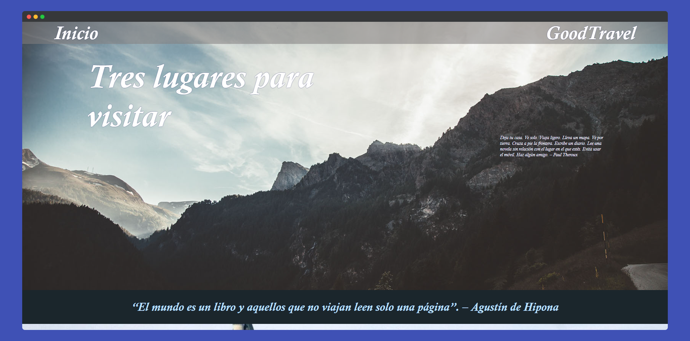

# **GoodTravel - Página Web de Destinos Soñados**



Este repositorio contiene un proyecto diseñado para principiantes que están aprendiendo HTML y CSS. El objetivo del proyecto es crear una página web simple que muestre tres lugares en los que te gustaría viajar o vivir. Cada destino incluye una imagen, un título y una breve descripción. El proyecto permite a los usuarios mejorar sus habilidades en el diseño y maquetación web de manera práctica y divertida.


## **Descripción del Proyecto**

El proyecto **GoodTravel** consiste en una página web que presenta tres destinos turísticos. Cada destino tiene su propia sección con una imagen representativa, un breve texto descriptivo y un enlace para obtener más detalles. El objetivo de este reto es mejorar tus habilidades en el uso de HTML y CSS, creando una estructura bien organizada y visualmente atractiva.

## **Características**

- Página web estructurada con HTML y estilizada con CSS.
- Presentación de tres destinos turísticos con imagen, título y descripción.
- Botones de "Ver más" que llevan a páginas de detalles adicionales.
- Diseño básico pero funcional, con enfoque en el aprendizaje de HTML y CSS.
- Secciones principales: encabezado, contenido principal y pie de página.
  

Estructura del Proyecto
El proyecto sigue una estructura simple de archivos y carpetas:

```
└── 📁GoodTravel    
    └── 📁publicaciones
        └── publicacion1.html
        └── publicacion2.html
        └── publicacion3.html  
    └── 📁resource
        └── 📁images
            └── 📁lugar1
                └── lugar1img1.jpg
                └── lugar1img2.jpg
                └── lugar1img3.jpg
            └── 📁lugar2
                └── lugar2img1.jpg
                └── lugar2img2.jpg
                └── lugar2img3.jpg
            └── 📁lugar3
                └── lugar3Img1.jpg
                └── lugar3Img2.jpg
                └── lugar3Img3.jpg
            └── imgHeader.jpg
    └── 📁style
        └── style_index.css
        └── style_index.min.css
        └── style_index.scss
        └── style_publicacion.css
    └── Index.html
    └── README.md
```

## **Uso**

1. Abre el archivo `index.html` en tu navegador preferido.
2. Explora los tres destinos y haz clic en los botones "Ver más" para obtener más detalles sobre cada lugar.
3. Si deseas editar el contenido, puedes modificar los archivos HTML o los estilos CSS.

## **Licencia**

Este proyecto está licenciado bajo la licencia MIT.
